# Model map: `Quality Detail` perspective

Generated from `ssasprod.bim`. 11 in-perspective tables (13 internal relationships), 6 external tables reachable via 7 bridging relationships.

## ER diagram

```mermaid
erDiagram
    Calendar {
        string _ "Calendar"
    }
    Quality_Detail {
        string _ "Quality Detail"
    }
    Work_Order_Detail {
        string _ "Work Order Detail"
    }
    Item_Branch {
        string _ "Item Branch"
    }
    Branch {
        string _ "Branch"
    }
    Branch_Company {
        string _ "Branch Company"
    }
    Customer_Ship_To {
        string _ "Customer Ship To"
    }
    Date {
        string _ "Date"
    }
    Lot {
        string _ "Lot"
    }
    Audit {
        string _ "Audit"
    }
    Calendar_Filter {
        string _ "Calendar Filter"
    }
    Address {
        string _ "Address"
    }
    Asset {
        string _ "Asset"
    }
    Business_Unit {
        string _ "Business Unit"
    }
    Item_Master_Additional_Information {
        string _ "Item Master Additional Information"
    }
    Item_Shipping_Information {
        string _ "Item Shipping Information"
    }
    Work_Order {
        string _ "Work Order"
    }
    Quality_Detail }o--|| Branch : "BranchSKey"
    Quality_Detail }o--|| Item_Branch : "ItemBranchSKey"
    Quality_Detail }o--|| Lot : "LotSKey"
    Quality_Detail }o--|| Date : "BasedOnDateSKey -> DateSKey"
    Work_Order_Detail }o--|| Item_Branch : "ItemBranchSKey"
    Work_Order_Detail }o--|| Lot : "LotSKey"
    Work_Order_Detail }o--|| Date : "(inactive) CompletionDateSKey -> DateSKey"
    Work_Order_Detail }o--|| Date : "OrderDateSKey -> DateSKey"
    Work_Order_Detail }o--|| Date : "(inactive) StartDateSKey -> DateSKey"
    Work_Order_Detail }o--|| Branch : "BranchSKey"
    Branch }o--|| Branch_Company : "CompanySKey"
    Calendar }o--|| Date : "Calendar Date -> CalendarDate"
    Quality_Detail }o--|| Customer_Ship_To : "ShipToCustomerSKey"
    Work_Order_Detail }o--|| Address : "AddressSKey"
    Work_Order_Detail }o--|| Asset : "AssetSKey"
    Work_Order_Detail }o--|| Business_Unit : "BusinessUnitSKey"
    Work_Order_Detail }o--|| Work_Order : "WorkOrderSKey"
    Item_Branch }o--|| Item_Shipping_Information : "Item Num Short -> ItemNumberShort"
    Item_Branch }o--|| Item_Master_Additional_Information : "Item Num Short -> ItemNumShort"
    Quality_Detail }o--|| Work_Order : "LotWOSKey"
```

## Tables

| Role | Table | Cols | Measures | Source / notes |
|------|-------|-----:|---------:|----------------|
| fact | `Calendar` | 78 | 5 | Sales Order uses Scheduled Picked Date, AR uses Invoice Date (GL), all other GL Date |
| fact | `Quality Detail` | 40 | 30 | F3711 \| Active based on date for Calendar: [F3711.TRQDAT] |
| fact | `Work Order Detail` | 28 | 291 |  |
| bridge | `Item Branch` | 132 | 1 | F4102 |
| dim | `Branch` | 29 | 0 | F0006 |
| dim | `Branch Company` | 6 | 0 | F0010 |
| dim | `Customer Ship To` | 86 | 0 | F03012 join to F4211/9 SDSHAN |
| dim | `Date` | 2 | 0 |  |
| dim | `Lot` | 43 | 2 | F4108 |
| standalone | `Audit` | 2 | 5 |  |
| standalone | `Calendar Filter` | 4 | 1 | Use as filter or slicer to dynamically change based on calendar for analysis |
| external | `Address` | 68 | 0 | F0101 \| F0116 |
| external | `Asset` | 24 | 0 | F1201 |
| external | `Business Unit` | 34 | 0 | F0006 |
| external | `Item Master Additional Information` | 43 | 0 |  |
| external | `Item Shipping Information` | 24 | 0 |  |
| external | `Work Order` | 41 | 0 | F4801 |

## Relationships

| Kind | From (many) | Column | To (one) | Column | Active |
|------|-------------|--------|----------|--------|--------|
| internal | `Branch` | `CompanySKey` | `Branch Company` | `CompanySKey` | yes |
| internal | `Calendar` | `Calendar Date` | `Date` | `CalendarDate` | yes |
| bridging | `Item Branch` | `Item Num Short` | `Item Master Additional Information` | `ItemNumShort` | yes |
| bridging | `Item Branch` | `Item Num Short` | `Item Shipping Information` | `ItemNumberShort` | yes |
| internal | `Quality Detail` | `BranchSKey` | `Branch` | `BranchSKey` | yes |
| internal | `Quality Detail` | `ShipToCustomerSKey` | `Customer Ship To` | `ShipToCustomerSKey` | yes |
| internal | `Quality Detail` | `BasedOnDateSKey` | `Date` | `DateSKey` | yes |
| internal | `Quality Detail` | `ItemBranchSKey` | `Item Branch` | `ItemBranchSKey` | yes |
| internal | `Quality Detail` | `LotSKey` | `Lot` | `LotSKey` | yes |
| bridging | `Quality Detail` | `LotWOSKey` | `Work Order` | `LotWOSKey` | yes |
| bridging | `Work Order Detail` | `AddressSKey` | `Address` | `AddressSKey` | yes |
| bridging | `Work Order Detail` | `AssetSKey` | `Asset` | `AssetSKey` | yes |
| internal | `Work Order Detail` | `BranchSKey` | `Branch` | `BranchSKey` | yes |
| bridging | `Work Order Detail` | `BusinessUnitSKey` | `Business Unit` | `BusinessUnitSKey` | yes |
| internal | `Work Order Detail` | `CompletionDateSKey` | `Date` | `DateSKey` | **no** |
| internal | `Work Order Detail` | `OrderDateSKey` | `Date` | `DateSKey` | yes |
| internal | `Work Order Detail` | `StartDateSKey` | `Date` | `DateSKey` | **no** |
| internal | `Work Order Detail` | `ItemBranchSKey` | `Item Branch` | `ItemBranchSKey` | yes |
| internal | `Work Order Detail` | `LotSKey` | `Lot` | `LotSKey` | yes |
| bridging | `Work Order Detail` | `WorkOrderSKey` | `Work Order` | `WorkOrderSKey` | yes |
