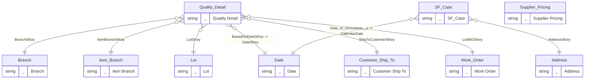

# Model map: `Quality SF` perspective

Generated from `ssasprod.bim`. 3 in-perspective tables (0 internal relationships), 7 external tables reachable via 8 bridging relationships.

## ER diagram

## Tables

| Role | Table | Cols | Measures | Source / notes |
|------|-------|-----:|---------:|----------------|
| fact | `Quality Detail` | 40 | 30 | F3711 \| Active based on date for Calendar: [F3711.TRQDAT] |
| fact | `SF_Case` | 139 | 1 |  |
| standalone | `Supplier Pricing` | 28 | 0 | F41061 |
| external | `Address` | 68 | 0 | F0101 \| F0116 |
| external | `Branch` | 29 | 0 | F0006 |
| external | `Customer Ship To` | 86 | 0 | F03012 join to F4211/9 SDSHAN |
| external | `Date` | 2 | 0 |  |
| external | `Item Branch` | 132 | 1 | F4102 |
| external | `Lot` | 43 | 2 | F4108 |
| external | `Work Order` | 41 | 0 | F4801 |

## Relationships

| Kind | From (many) | Column | To (one) | Column | Active |
|------|-------------|--------|----------|--------|--------|
| bridging | `Quality Detail` | `BranchSKey` | `Branch` | `BranchSKey` | yes |
| bridging | `Quality Detail` | `ShipToCustomerSKey` | `Customer Ship To` | `ShipToCustomerSKey` | yes |
| bridging | `Quality Detail` | `BasedOnDateSKey` | `Date` | `DateSKey` | yes |
| bridging | `Quality Detail` | `ItemBranchSKey` | `Item Branch` | `ItemBranchSKey` | yes |
| bridging | `Quality Detail` | `LotSKey` | `Lot` | `LotSKey` | yes |
| bridging | `Quality Detail` | `LotWOSKey` | `Work Order` | `LotWOSKey` | yes |
| bridging | `SF_Case` | `AddressSKey` | `Address` | `AddressSKey` | yes |
| bridging | `SF_Case` | `Date_of_Occurance__c` | `Date` | `CalendarDate` | yes |
