# Model map: `Sales Order` perspective

Generated from `ssasprod.bim`. 23 in-perspective tables (22 internal relationships), 4 external tables reachable via 4 bridging relationships.

## ER diagram

```mermaid
erDiagram
    Calendar {
        string _ "Calendar"
    }
    Item_Branch_Additional_Information {
        string _ "Item Branch Additional Information"
    }
    Sales {
        string _ "Sales"
    }
    Item_Branch {
        string _ "Item Branch"
    }
    Address {
        string _ "Address"
    }
    Branch {
        string _ "Branch"
    }
    Branch_Company {
        string _ "Branch Company"
    }
    CSR_for_Sales_Orders {
        string _ "CSR for Sales Orders"
    }
    Customer {
        string _ "Customer"
    }
    Customer_Bill_To {
        string _ "Customer Bill To"
    }
    Customer_Parent {
        string _ "Customer Parent"
    }
    Customer_Ship_To {
        string _ "Customer Ship To"
    }
    Date {
        string _ "Date"
    }
    Industry_Classification {
        string _ "Industry Classification"
    }
    Revenue_Business_Unit {
        string _ "Revenue Business Unit"
    }
    SF_Opportunity {
        string _ "SF_Opportunity"
    }
    SF_OpportunityLineItem {
        string _ "SF_OpportunityLineItem"
    }
    Subledger {
        string _ "Subledger"
    }
    Territory_Manager {
        string _ "Territory Manager"
    }
    Audit {
        string _ "Audit"
    }
    Budget_Forecast {
        string _ "Budget Forecast"
    }
    Calendar_Filter {
        string _ "Calendar Filter"
    }
    Selected_Time_Calc_Filter {
        string _ "Selected Time Calc Filter"
    }
    Item_Master_Additional_Information {
        string _ "Item Master Additional Information"
    }
    Item_Shipping_Information {
        string _ "Item Shipping Information"
    }
    Lot {
        string _ "Lot"
    }
    Work_Order {
        string _ "Work Order"
    }
    Sales }o--|| Subledger : "SubledgerSKey"
    Sales }o--|| Item_Branch : "ItemBranchSKey"
    Sales }o--|| Customer : "SoldToCustomerSKey -> CustomerSKey"
    Sales }o--|| Customer_Parent : "ParentCustomerSKey"
    Sales }o--|| Customer_Ship_To : "ShipToCustomerSKey"
    Sales }o--|| Date : "(inactive) Order Date -> CalendarDate"
    Sales }o--|| Date : "(inactive) Invoice Date -> CalendarDate"
    Sales }o--|| Date : "(inactive) Actual Ship Date -> CalendarDate"
    Sales }o--|| Date : "GL Date -> CalendarDate"
    Sales }o--|| Branch : "BranchSKey"
    Customer }o--|| Address : "AddressSKey"
    Sales }o--|| Customer_Bill_To : "BillToCustomerSKey"
    Sales }o--|| Revenue_Business_Unit : "BusinessUnitHeaderSKey"
    Sales }o--|| CSR_for_Sales_Orders : "CompositeKey"
    Sales }o--|| Date : "(inactive) Scheduled Pick Date -> CalendarDate"
    Sales }o--|| Territory_Manager : "TerritoryManagerSKey"
    Branch }o--|| Branch_Company : "CompanySKey"
    Calendar }o--|| Date : "Calendar Date -> CalendarDate"
    Item_Branch_Additional_Information }o--|| Item_Branch : "ItemBranchISKey"
    Sales }o--|| Industry_Classification : "IndustryClassificationKey"
    Sales }o--|| SF_OpportunityLineItem : "IndustryClassificationKey -> SalesforceLineItemID"
    SF_OpportunityLineItem }o--|| SF_Opportunity : "Opportunity ID -> ID - Opportunity"
    Sales }o--|| Lot : "LotSKey"
    Sales }o--|| Work_Order : "WorkOrderSKey"
    Item_Branch }o--|| Item_Shipping_Information : "Item Num Short -> ItemNumberShort"
    Item_Branch }o--|| Item_Master_Additional_Information : "Item Num Short -> ItemNumShort"
```

## Tables

| Role | Table | Cols | Measures | Source / notes |
|------|-------|-----:|---------:|----------------|
| fact | `Calendar` | 78 | 5 | Sales Order uses Scheduled Picked Date, AR uses Invoice Date (GL), all other GL Date |
| fact | `Item Branch Additional Information` | 48 | 0 |  |
| fact | `Sales` | 162 | 468 | F4211 \| F42119 \| F4201 \| F42019 \| Active based on date for Calendar: GL Date [F4211/F42119.SDDGL] |
| bridge | `Item Branch` | 132 | 1 | F4102 |
| dim | `Address` | 68 | 0 | F0101 \| F0116 |
| dim | `Branch` | 29 | 0 | F0006 |
| dim | `Branch Company` | 6 | 0 | F0010 |
| dim | `CSR for Sales Orders` | 6 | 0 |  |
| dim | `Customer` | 114 | 0 | F03012 join to F4211/9 SDAN8 Sold To data |
| dim | `Customer Bill To` | 81 | 0 | F03012 join to F4201/9 SHITAN |
| dim | `Customer Parent` | 82 | 0 | F03012 join to F4211/9 SDPA8 |
| dim | `Customer Ship To` | 86 | 0 | F03012 join to F4211/9 SDSHAN |
| dim | `Date` | 2 | 0 |  |
| dim | `Industry Classification` | 22 | 0 | Where CUSMI <> ' ' |
| dim | `Revenue Business Unit` | 25 | 0 | F0006 |
| dim | `SF_Opportunity` | 31 | 0 |  |
| dim | `SF_OpportunityLineItem` | 20 | 0 |  |
| dim | `Subledger` | 6 | 0 | F4801 \| F1201 \| F0006 \| F0101 |
| dim | `Territory Manager` | 8 | 0 | F42140 |
| standalone | `Audit` | 2 | 5 |  |
| standalone | `Budget Forecast` | 36 | 0 | F3460 \| F554101 \| F0006 |
| standalone | `Calendar Filter` | 4 | 1 | Use as filter or slicer to dynamically change based on calendar for analysis |
| standalone | `Selected Time Calc Filter` | 3 | 0 | Use as slicer, filter, or column to dynamically change time calculation [..Selected] measures |
| external | `Item Master Additional Information` | 43 | 0 |  |
| external | `Item Shipping Information` | 24 | 0 |  |
| external | `Lot` | 43 | 2 | F4108 |
| external | `Work Order` | 41 | 0 | F4801 |

## Relationships

| Kind | From (many) | Column | To (one) | Column | Active |
|------|-------------|--------|----------|--------|--------|
| internal | `Branch` | `CompanySKey` | `Branch Company` | `CompanySKey` | yes |
| internal | `Calendar` | `Calendar Date` | `Date` | `CalendarDate` | yes |
| internal | `Customer` | `AddressSKey` | `Address` | `AddressSKey` | yes |
| bridging | `Item Branch` | `Item Num Short` | `Item Master Additional Information` | `ItemNumShort` | yes |
| bridging | `Item Branch` | `Item Num Short` | `Item Shipping Information` | `ItemNumberShort` | yes |
| internal | `Item Branch Additional Information` | `ItemBranchISKey` | `Item Branch` | `ItemBranchISKey` | yes |
| internal | `SF_OpportunityLineItem` | `Opportunity ID` | `SF_Opportunity` | `ID - Opportunity` | yes |
| internal | `Sales` | `BranchSKey` | `Branch` | `BranchSKey` | yes |
| internal | `Sales` | `CompositeKey` | `CSR for Sales Orders` | `CompositeKey` | yes |
| internal | `Sales` | `SoldToCustomerSKey` | `Customer` | `CustomerSKey` | yes |
| internal | `Sales` | `BillToCustomerSKey` | `Customer Bill To` | `BillToCustomerSKey` | yes |
| internal | `Sales` | `ParentCustomerSKey` | `Customer Parent` | `ParentCustomerSKey` | yes |
| internal | `Sales` | `ShipToCustomerSKey` | `Customer Ship To` | `ShipToCustomerSKey` | yes |
| internal | `Sales` | `Order Date` | `Date` | `CalendarDate` | **no** |
| internal | `Sales` | `Invoice Date` | `Date` | `CalendarDate` | **no** |
| internal | `Sales` | `Actual Ship Date` | `Date` | `CalendarDate` | **no** |
| internal | `Sales` | `GL Date` | `Date` | `CalendarDate` | yes |
| internal | `Sales` | `Scheduled Pick Date` | `Date` | `CalendarDate` | **no** |
| internal | `Sales` | `IndustryClassificationKey` | `Industry Classification` | `IndustryClassificationKey` | yes |
| internal | `Sales` | `ItemBranchSKey` | `Item Branch` | `ItemBranchSKey` | yes |
| bridging | `Sales` | `LotSKey` | `Lot` | `LotSKey` | yes |
| internal | `Sales` | `BusinessUnitHeaderSKey` | `Revenue Business Unit` | `BusinessUnitHeaderSKey` | yes |
| internal | `Sales` | `IndustryClassificationKey` | `SF_OpportunityLineItem` | `SalesforceLineItemID` | yes |
| internal | `Sales` | `SubledgerSKey` | `Subledger` | `SubledgerSKey` | yes |
| internal | `Sales` | `TerritoryManagerSKey` | `Territory Manager` | `TerritoryManagerSKey` | yes |
| bridging | `Sales` | `WorkOrderSKey` | `Work Order` | `WorkOrderSKey` | yes |
